## 一、图形学入门

**常用公式**：

- 已知三角形三点坐标，三角形面积为$S=\frac{1}{2}[x_1(y_2-y_3)+x_2(y_3-y_1)+x_3(y_1-y_2)]$

- 直线$Ax+By+C=0$，点$P(x_0,y_0)$到直线距离为$\frac{|Ax_0+By_0+C|}{\sqrt{A^2+B^2}}$
- $\vec{a}=(x_1,y_1,z_1),\vec{b}=(x_2,y_2,z_2)$，则$\vec{a}\times\vec{b}=i(y_1z_2-z_1y_2)+j(z_1x_2-x_1z_2)+k(x_1y_2-y_1x_2)$

**焦距**：眼到图像投影平面的距离

**透视投影**和**平行投影**的区别：透视投影焦距有限；平行投影焦距无限

**光栅化（Rasterizaton）**：将连续信号转变为离散像素的过程

**双缓存图像**：设置主要缓存和次要缓存，不断切换屏幕指向的缓存地址，以避免单屏幕显示的“显示，擦除”产生的闪烁

**深度缓存（Z-buffer）**：在光栅化每个像素点时，遍历几何体，同时记录该几何体在该像素点上的深度。如果下一个几何体深度更小，则该像素点替换成下个几何体的颜色。该方法用于解决几何体的先后问题。

## 二、坐标空间

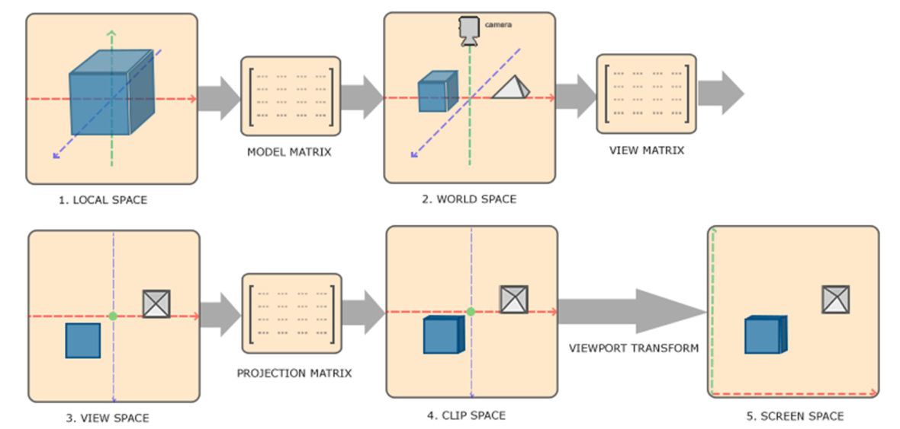

在三维空间的计算中，**点的坐标**表示为：
$$
(x,y,z,w)=(\frac{x}{w},\frac{y}{w},\frac{z}{w})
$$
注：当$w=0$时，该坐标代表向量

## 变换矩阵

### 平移

$$
T(\Delta x,\Delta y,\Delta z)=
\left(
\begin{array}{l}
1 & 0 & 0 & \Delta x\\
0 & 1 & 0 & \Delta y\\
0 & 0 & 1 & \Delta z\\
0 & 0 & 0 & 1
\end{array}
\right)
$$

### 拉伸

$$
T(x,y,z)=
\left(
\begin{array}{l}
x & 0 & 0 & 0\\
0 & y & 0 & 0\\
0 & 0 & z & 0\\
0 & 0 & 0 & 1
\end{array}
\right)
$$

### 旋转

$$
R_x(\theta)=
\left(
\begin{array}{l}
1 & 0 & 0 & 0\\
0 & \cos\theta & -\sin\theta & 0\\
0 & \sin\theta & \cos\theta & 0\\
0 & 0 & 0 & 1
\end{array}
\right)
$$

$$
R_y(\theta)=
\left(
\begin{array}{l}
\cos\theta & 0 & \sin\theta & 0\\
0 & 1 & 0 & 0\\
-\sin\theta & 0 & \cos\theta & 0\\
0 & 0 & 0 & 1
\end{array}
\right)
$$

$$
R_z(\theta)=
\left(
\begin{array}{l}
\cos\theta & -\sin\theta & 0 & 0\\
\sin\theta & \cos\theta & 0 & 0\\
0 & 0 & 1 & 0\\
0 & 0 & 0 & 1
\end{array}
\right)
$$

$$
R(\theta)=R_x(\theta)R_y(\theta)R_z(\theta)
$$

注：法向量在不均匀缩放情况下直接乘以model矩阵会不垂直于交点，$N'=mat3(transpose(model^{-1})) * N$

## View矩阵

步骤为先将相机平移到原点，再旋转，所以将世界坐标系做逆变换就能得到View矩阵（相机位置为$(0,0,0)$，看向$-z$
$$
M_v=R^{-1}T^{-1}
$$

$$
T^{-1}=
\left(
\begin{array}{l}
1 & 0 & 0 & -x_e\\
0 & 1 & 0 & -y_e\\
0 & 0 & 1 & -z_e\\
0 & 0 & 0 & 1
\end{array}
\right)，
R^{-1}=
\left(
\begin{array}{l}
x_{\hat{g}\times\hat{t}} & x_{\hat{t}} & x_{-\hat{g}} & 0\\
y_{\hat{g}\times\hat{t}} & y_{\hat{t}}  & y_{-\hat{g}} & 0\\
z_{\hat{g}\times\hat{t}} & z_{\hat{t}}  & z_{-\hat{g}} & 0\\
0 & 0 & 0 & 1
\end{array}
\right)
$$

其中，$\hat{t}$向$y$转，$\hat{g}$向$-z$转，$\hat{g}\times\hat{t}$向$x$转

## 投影矩阵

### 透视投影

$$
M_p=
\left(
\begin{array}{l}
\frac{2n}{r-l} & 0 & \frac{r+l}{r-l} & 0\\
0 & \frac{2n}{t-b} & \frac{t+b}{t-b} & 0\\
0 & 0 & \frac{-(f+n)}{f-n} & \frac{-2fn}{f-n}\\
0 & 0 & -1 & 0
\end{array}
\right),
where
\left\{
\begin{array}{l}
t=n\tan\frac{fovY}{2}\\
r=aspect\_ratio\times n\tan\frac{fovY}{2}\\
l=-r\\
t=-b
\end{array}
\right.
$$

证明：

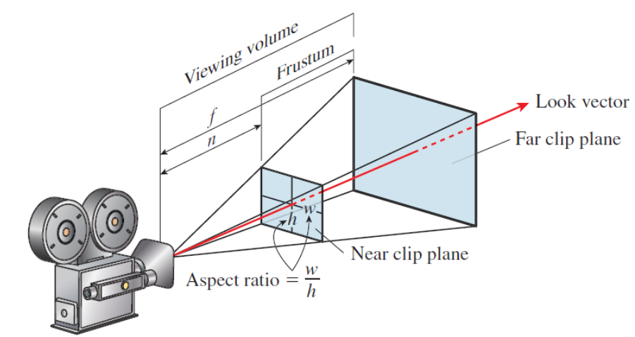

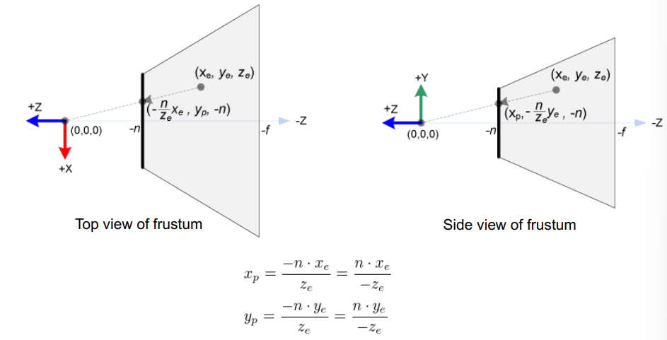

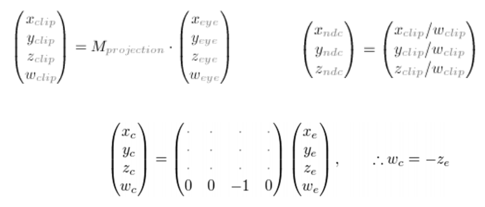

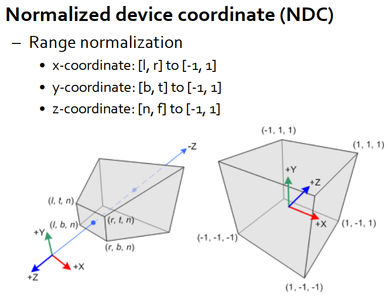

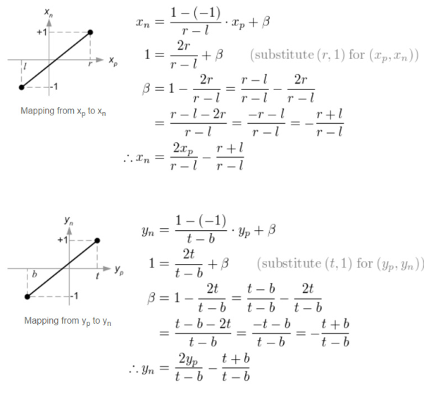

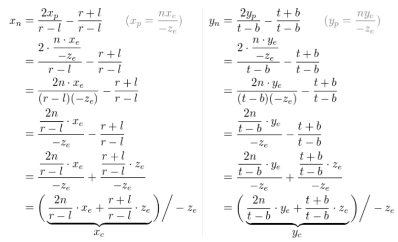

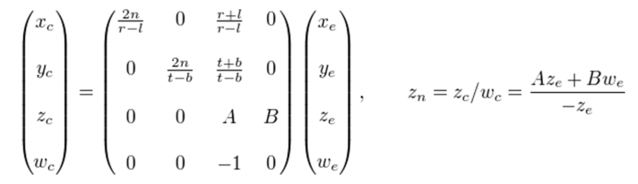

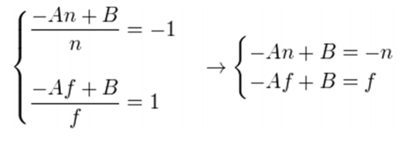

### 平行矩阵

$$
M_o=
\left(
\begin{array}{l}
\frac{2}{r-l} & 0 & 0 & -\frac{r+l}{r-l}\\
0 & \frac{2}{t-b} & 0 & \frac{t+b}{t-b}\\
0 & 0 & \frac{-2}{f-n} & -\frac{f+n}{f-n}\\
0 & 0 & 0 & 1
\end{array}
\right)
$$

## 观察矩阵

$[-1,1]^2\rightarrow[0,width]\times[0,height]$
$$
M_viewport=
\left(
\begin{array}{c}
\frac{width}{2} & 0 & 0 & \frac{width}{2}\\
0 & \frac{height}{2} & 0 & \frac{height}{2}\\
0 & 0 & 1 & 0\\
0 & 0 & 0 & 1
\end{array}
\right)
$$

## 光栅化

### Bresenham算法

在平面直角坐标系上，假设有一条直线，方程为$f(x,y)=Ax+By+C,A=\Delta y,B=-\Delta x,C=(\Delta x)b$，注意这里斜率不能过大。从$(x_0,y_0)$开始，决定需要填色的像素是$(x_0+1,y_0)$还是$(x_0+1,y_0+1)$，目标是寻找其中一个距离直线更近的点

**解决**：将$x=x_0+1,y=y_0+\frac{1}{2}$代入直线方程，若$f(x_0+1,y_0+\frac{1}{2})<=0$，则选择$(x_0+1,y_0)$涂色，若$f(x_0+1,y_0+\frac{1}{2})>0$，则选择$(x_0+1,y_0+1)$涂色

### 三角形取点

对于三角形每一条直线，做Bresenham算法：$P_i=(X_i,Y_i)$，$\ dX_i=X_{i+1}-X_i$，$\ dY_i=Y_{i+1}-Y_i$
$$
E_i(x,y)=(x-X_i)dY_i-(y-Y_i)dX_i
\left\{
\begin{align}
&=0: point\ on\ edge\\
&>0: outside\ edge\\
&<0: inside\ edge
\end{align}
\right.
$$
取所有点，当三条直线$E_i(x,y)$同时满足$<0$时，该点为三角形内的点

## 上色

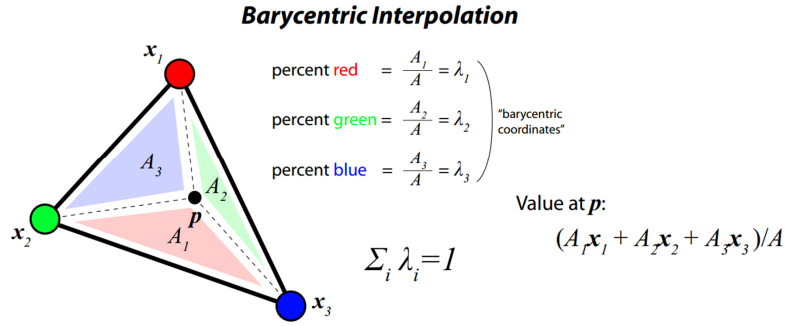

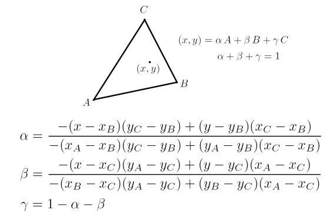

# 三、曲线和三角化

**德劳内三角剖分法**（构造Mesh）：任意三角形的外接圆内没有第四个点

**翻转 Flipping**：如果两个三角形未满足德劳内，则换中间连线

**泰森多边形 Voronoi Diagram**：将平面划分为不同区域（每个区域只有一个点），使该区域到区域中的点距离最近，这些区域叫做**Voronoi Cells**，可由中垂线法生成。

泰森多边形和德劳内三角是对偶关系，连接泰森多边形相邻的点即可获得德劳内三角剖分

# 四、几何模型

椭球模型：$\frac{x^2}{a^2}+\frac{y^2}{b^2}+\frac{z^2}{c^2}=1$

椭球坐标变换：$x=a\cos(u)\cos(v),y=b\cos(u)\sin(v),z=c\sin(u)$，$-\frac{\pi}{2}\leq u\leq\frac{\pi}{2},-\pi\leq v\leq \pi$

对于曲线某点的切线，直接求偏导；对于曲面某点的法向量，先按照两个不同方向求偏导，得两个切线，再对两个切线的方向向量做叉乘

**插值问题**：给定值的映射序列，找到满足该映射的函数

**多项式插值**：对于$n+1$个数据，构造一个最大项为$n$次的多项式，将数据带入求解

多项式插值的震荡现象：当多项式阶数很高时，会在边缘点发生强烈的震荡

**样条插值**：样条插值是一种**分段定义**的低阶多项式函数，但阶数也不能过低，需要保证一定的曲线连续性，通常考虑三阶的样条插值

**三阶样条插值**：定义$p(x)=a+bx+cx^2+dx^3$，其具有二阶导数连续性，在结点处一致

给定定义在$[a,b]$上的函数$f(x)$和结点集合$a=x_0<x_1<...<x_n=b$，样条曲线为：
$$
S(x)=
\left\{
\begin{align}
&a_0+b_0(x-x_0)+c_0(x-x_0)^2+d_0(x-x_0)^3,&if\ x_0\leq x\leq x_1\\
&a_1+b_1(x-x_1)+c_1(x-x_1)^2+d_1(x-x_1)^3,&if\ x_1\leq x\leq x_2\\
&...\\
&a_{n-1}+b_{n-1}(x-x_{n-1})+c_{n-1}(x-x_{n-1})^2+d_{n-1}(x-x_{n-1})^3,&if\ x_{n-1}\leq x\leq x_n\\
\end{align}
\right.
$$

**同时要满足**：对于每个结点，$S$值与$f$值一致；连续两条样条曲线共有点的值一致；连续两条样条曲线在共有点的一阶导数一致；连续两条样条曲线在共有点的二阶导数一致

**还要满足下述其一**：$S''(x_0)=S''(x_n)=0$（自然样条）或$S'(x_0)=f'(x_0),S'(x_n)=f'(x_n)$（紧凑样条）

**Bernstein Basis：** $b_{v,n}(x)=\left(\begin{align}&n\\&v\end{align}\right)x^v(1-x)^{n-v}$

**贝塞尔曲线：** $B(t)=\sum^n_{i=0}b_{i,n}(t)P_i=\sum^n_{i=0}\left(\begin{align}&n\\&v\end{align}\right)t^i(1-t)^{n-i}P_i$，其中$P_i$是控制点

**de Casteljau：**$\beta^{(0)}_i=\beta_i,i=0,...,n$ and $\beta^{(j)}_i=\beta^{(j-1)}_i(1-t_0)+\beta^{(j-1)}_{i+1}t_0, i=0,...,n-j,j=1,...,n$

**贝塞尔曲面：**$P(u,v)=\sum^n_{i=1}\sum^m_{j=0}B^n_i(u)B^m_j(v)k_{i,j}$，其有$(n+1)(m+1)$个控制点定义

**B样条曲线：**$S_{n,t}(x)=\sum^{degree}_{i=0}\alpha_iB_{i,n}(x)$

**Coxde Boor法解B样条曲线：**
$$
B_{i,1}(x)=\left\{
\begin{align}
&1, &t_i\leq x \leq t_{i+1}\\
&0, &otherwise\\
\end{align}
\right.\\
B_{i,k}(x)=\frac{x-t_i}{t_{i+k-1}-t_i}B_{i,k-1}(x)+\frac{t_{i+k}-x}{t_{i+k}-t_{i+1}}B_{i+1,k-1}(x)
$$
**Catmull细分曲面**：

- 增加面中心点：$v_F=\sum^n_{i=1}\frac{1}{n}v_i$
- 增加边点：$v_E=\frac{v+w+v_{F_1}+v_{F_2}}{4}$，其中$v,w$是边端点，$v_{F_1},v_{F_2}$是生成的相邻面中心点
- 改变原来点的值：$v'=\frac{1}{n}Q+\frac{2}{n}R+\frac{n-3}{n}v$，其中$n$为面的顶点数，如正方形为$n=3$，$Q$为所有相邻生成面中心点的均值，$R$为所有和该点相邻的生成的边点的均值

# 五、几何渲染

## 冯模型 Phong reflection model

光的组成：

- 环境光Ambient：**常量**光源（与观看角度无关）
- 漫射光Diffuse：均匀发射向任意方向的光源（与观看角度无关）
- 镜面光Specular：向特定方向反射的光源（和观看角度有关）

注：对于物体也定义了如上三种属性
$$
I_p=k_ai_a+\sum_{m\in lights}(k_d(\hat{L_m}\cdot \hat{N})i_{m,d}+k_s(\hat{R_m}\cdot \hat{V})^\alpha i_{m,s})
$$
其中$k_a,k_d,k_s$分别是环境光、漫反射、镜面反射常量，和光属性相关；$i_a,i_{m,d},i_{m,s}$和物体属性相关；$\hat{L}_m$代表归一后光射入的反向向量，$\hat{N}$代表归一后光和物体交点物体的法向量，二者点乘得夹角$\theta$；$\hat{R}_m$是出射光线，且$\hat{R}_m=2(\hat{L}_m\cdot \hat{N})\hat{N}-\hat{L}_m$，$\hat{V}$代表从交点指向相机的向量，$\alpha$控制shininess，值越低，图形越善亮

## 布林冯模型 Blinn-Phone

定义$H=\frac{\hat{L}_m+\hat{V}}{||\hat{L}_m+\hat{V}||}$，用$(\hat{N}\cdot H)^{\alpha'}$代替冯模型中$(\hat{R_m}\cdot \hat{V})^\alpha$

## XYZ颜色和RGB颜色

根据能量，定义$X=k\int_\lambda\Phi(\lambda)\bar{x}(\lambda)d\lambda$, $Y=k\int_\lambda\Phi(\lambda)\bar{y}(\lambda)d\lambda$, $Z=k\int_\lambda\Phi(\lambda)\bar{z}(\lambda)d\lambda$

进行归一化得$x=\frac{X}{X+Y+Z},y=\frac{Y}{X+Y+Z},z=\frac{Z}{X+Y+Z}$

将红绿蓝单独提取，定义$R=\int_\lambda S(\lambda)\bar{r}(\lambda)d\lambda$, $G=\int_\lambda S(\lambda)\bar{g}(\lambda)d\lambda$, $B=k\int_\lambda S(\lambda)\bar{b}(\lambda)d\lambda$

## 双向反射分布函数 BRDF

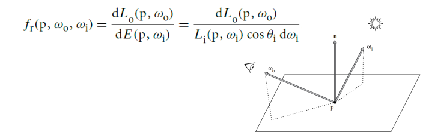
$$
L_0(p,\omega_0)=\int_{s^2}f(p,\omega_0,\omega_i)L_i(p,\omega_i)|\cos\theta_i|d\omega_i
$$
**折射**：$\upeta_i\sin\theta_i=\upeta_t\sin\theta_t$

# 六、纹理

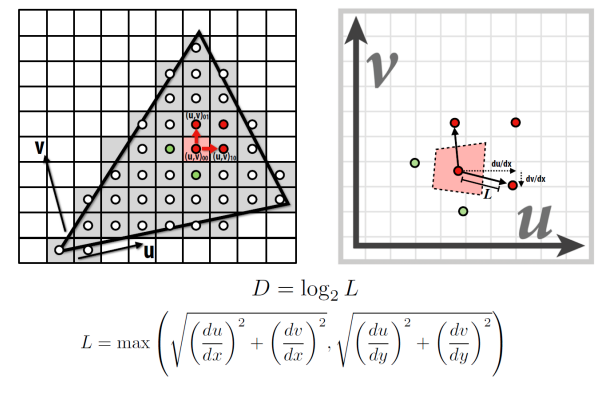

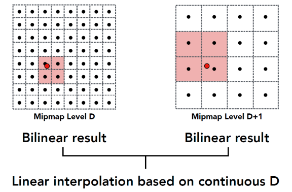

# 七、光线追踪

1. 计算光线$r(t)=o+td$和圆$f(x)=|x|^2-1$交点：

   将光线方程带入圆方程得$f(r(t))=|o+td|^2-1\rightarrow |d|^2t^2+2(o\cdot d)t+|o|^2-1=0$
   $$
   t=-o\cdot d \pm\sqrt{(o\cdot d)^2-|o|^2+1}
   $$

2. 计算光线$r(t)=o+td$和平面$N^Tx=c$交点：

   $N^Tr(t)=c\rightarrow N^T(o+td)=c\rightarrow t=\frac{c-N^To}{N^Td}\rightarrow r(t)=o+\frac{c-N^To}{N^Td}d$

3. 判断一个点是否在三角形内部？需要满足
   $$
   p(b_1,b_2)=(1-b_1-b_2)p_0+b_1p_1+b_2p_2,b_1\geq0,b_2\geq0,b_1+b_2\leq1
   $$
   将直线方程代入得
   $$
   o+td=(1-b_1-b_2)p_0+b_1p_1+b_2p_2,b_1\geq0,b_2\geq0,b_1+b_2\leq1\\
   $$
   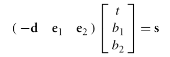

   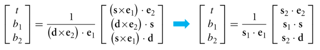

## 图形空间分割

- Octree：正方形不断分割成四个正方形，直至分割后正方形中图形数少于一定值，树状存储
- BVH：以图形将空间分割，将结点的基元分成不相连集合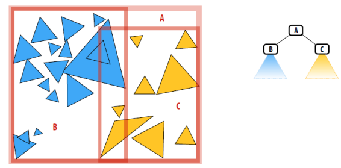

- K-D树：基元表示法，每个基元都由其中心点表示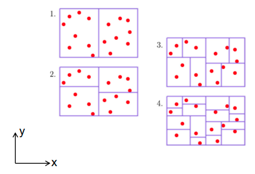

- Hybrid：每一个划分空间包含独立或是混合的树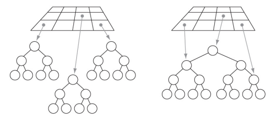

## 差异定义

给定$N$维序列$P$和一个采样序列$B$，$P$关于$B$的差异定义为

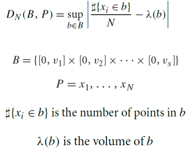

# 八、采样

球分布变换：$x=r\sin\theta\cos\phi,y=r\sin\theta\sin\phi,z=r\cos\theta$，假设我们想根据$p(r,\theta)$采样，先计算Jacobian矩阵的模，$|J_T|=r^2\sin\theta$，则有$p(r,\theta,\phi)=r^2\sin\theta p(x,y,z)$。根据球坐标定义的固定角$d\omega=\sin\theta d\theta d\phi$，则$p(\theta,\phi)d\theta d\phi=p(\omega)d\omega\rightarrow p(\theta,\phi)=\sin\theta p(\omega)$

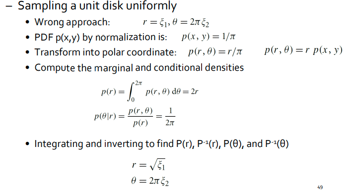

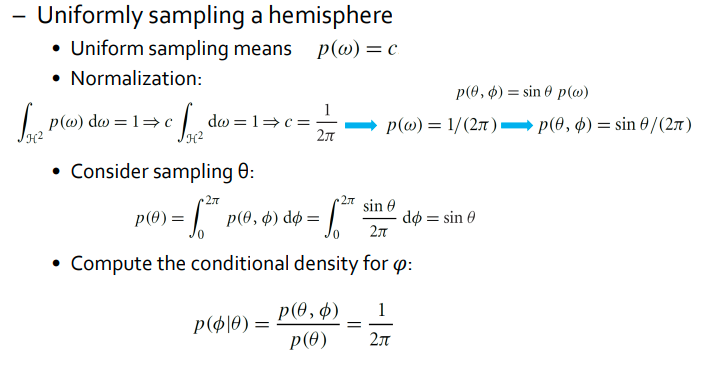

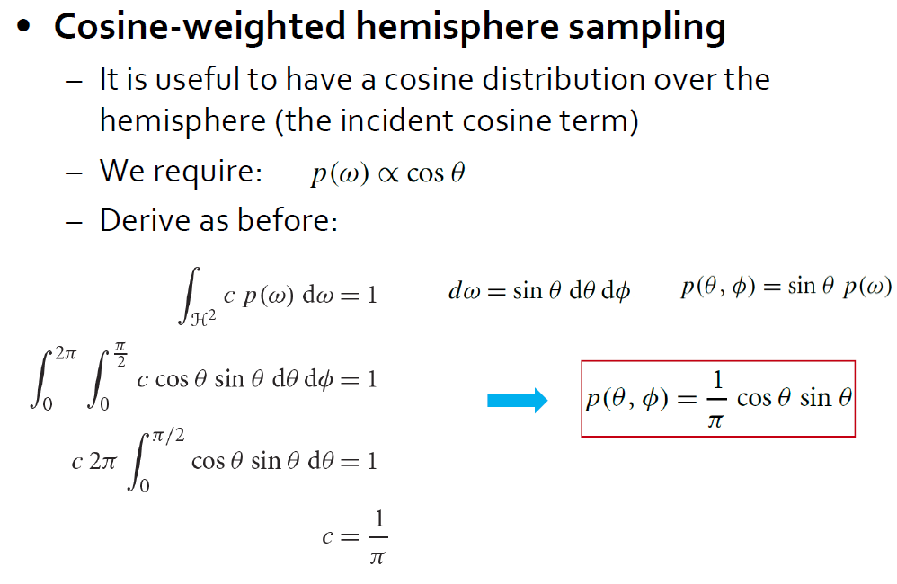

重要性采样：
$$
F_N=\frac{1}{N}\sum^N_{i=1}\frac{f(X_i)}{p(X_i)}
$$
如果$p(x)$和$f(x)$近似，则从$p(x)$中采样收敛很快

# 九、重建

在一个像素附近插值采样以进行重建，计算一个加权平均数：

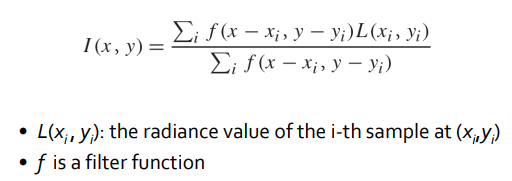

高斯滤波：轻微模糊

米切尔滤波：接收负值，提高边缘锐度

# 十、全局光照

双向路径追踪：

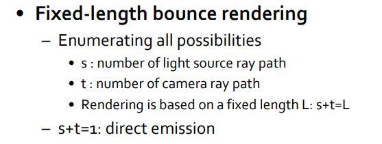

光子估计：光源发射，环境存储光子信息，当作二次光源

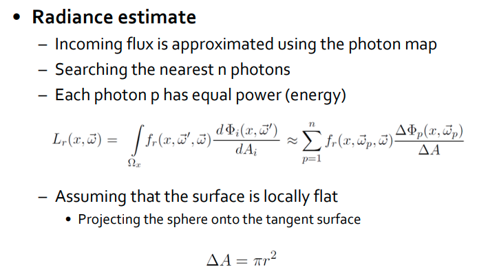

# 十一、体积渲染

体积渲染方程：

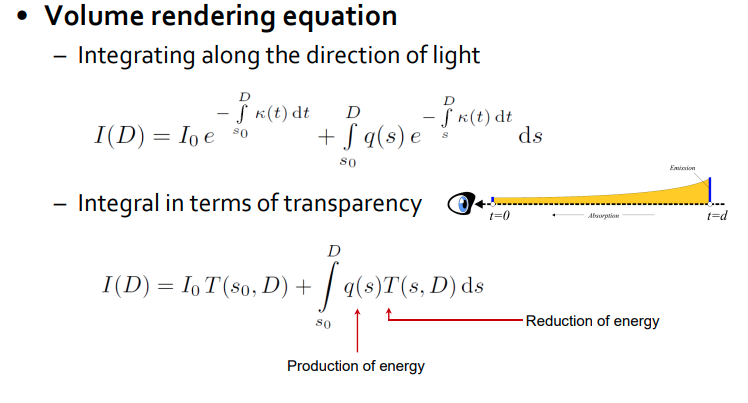

离散化

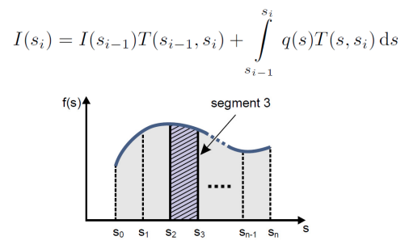

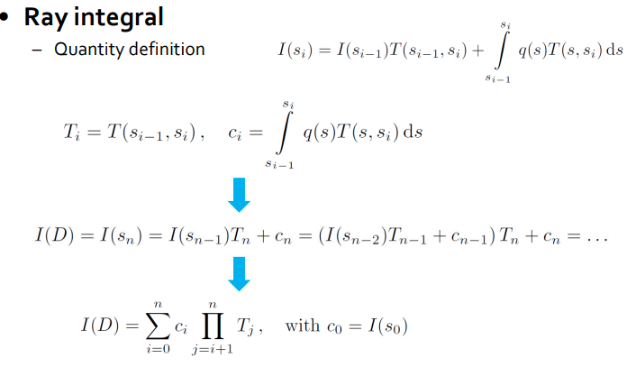

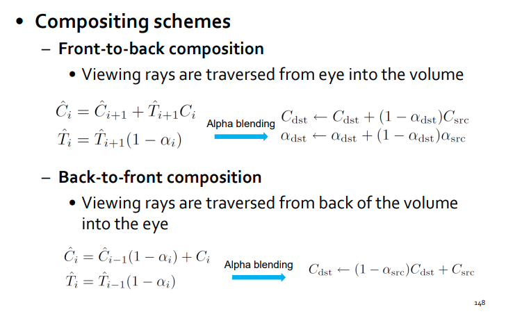
